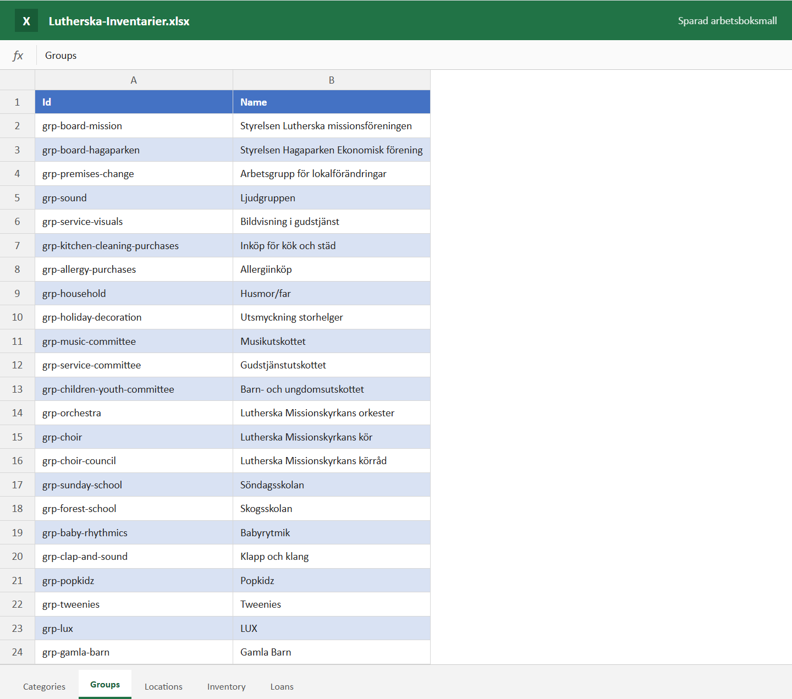
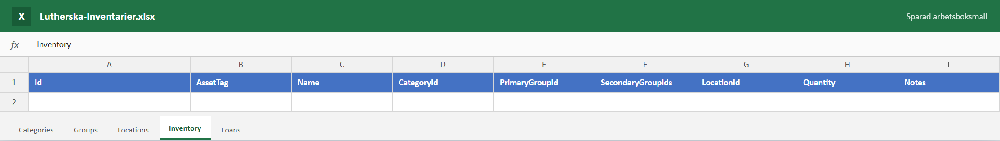
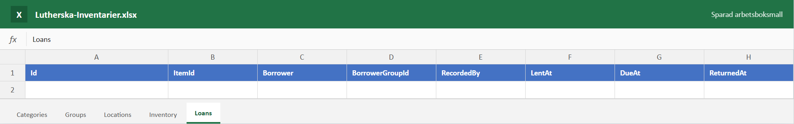

# Lutherska Inventarier

Lutherska Inventarier är kyrkans gemensamma register för inventarier och utlåning. Det används i webbläsaren på dator eller iPad. Själva informationen sparas i en Excel-arbetsbok i kyrkans Microsoft 365, inte på den publika webbsidan.

> Ser du **Sampleläge** högst upp? Då visas bara exempeldata i den aktuella webbläsaren. Registrera inte riktiga inventarier förrän statusen visar att Excel är anslutet.

## Det här kan ni göra

- Registrera föremål med märkning, antal, kategori, plats och anteckning.
- Ange en huvudansvarig grupp och vid behov flera andra berörda grupper.
- Registrera lån med låntagare, grupp, datum, planerad retur och vem som skrev in lånet.
- Se försenade lån tydligt markerade på översikten och under **Utlåning**.
- Lägga till eller byta namn på kategorier, grupper och platser under **Inställningar**.

Det finns ingen attest eller godkännandekedja. En användare med åtkomst kan registrera och avsluta ett lån direkt.

## Så arbetar en administratör

### Lägg till ett föremål

1. Öppna **Inventarier**.
2. Välj **Lägg till föremål**.
3. Fyll i uppgifterna och spara.

### Visa eller ändra ett föremål

1. Öppna **Inventarier**.
2. Klicka på föremålets rad.
3. Kontrollera eller ändra uppgifterna och välj **Spara ändringar**.

### Registrera eller avsluta ett lån

1. Öppna **Utlåning** och välj **Registrera lån**.
2. Ange föremål, låntagare, grupp, datum och planerad retur.
3. Klicka på en lånerad för att visa eller ändra uppgifterna.
4. När föremålet kommer tillbaka väljer du **Återlämna**.

### Ändra listorna

Öppna **Inställningar** för att lägga till eller byta namn på kategorier, verksamhetsgrupper och platser. Gör ändringen i appen i stället för direkt i Excel. Då behåller appen rätt kopplingar till redan registrerade föremål.

## Excel-filen bakom appen

Excel-filen heter `Lutherska-Inventarier.xlsx` och innehåller fem blad. De engelska rubrikerna är interna fältnamn som appen behöver. Den som använder appen till vardags behöver normalt inte öppna filen.

### Verksamhetsgrupper

Bladet **Groups** innehåller kyrkans 23 verksamhetsgrupper. Bilden är skapad från den riktiga arbetsboksmallen.

### Inventarier

Bladet **Inventory** fylls på när någon sparar ett föremål i appen. Mallen är tom från början.

### Utlåning

Bladet **Loans** fylls på när ett lån registreras. Återlämningsdatum sparas på samma rad när lånet avslutas.

De övriga bladen är **Categories** för kategorier och **Locations** för platser. Byt inte namn på bladen, tabellerna eller kolumnrubrikerna. Det kan bryta kopplingen till appen.

## Var finns informationen?

| Del | Vad den gör | Innehåller kyrkans register? |
| --- | --- | --- |
| Webbsidan på GitHub Pages | Visar appens knappar, formulär och listor | Nej |
| Microsoft-inloggningen | Kontrollerar vem användaren är | Nej |
| Kyrkans OneDrive | Lagrar Excel-filen | Ja |
| Användarens webbläsare | Visar informationen medan appen används | Tillfälligt |

Webbsidan och källkoden är offentliga för att GitHub Pages ska kunna användas kostnadsfritt. Det gör inte Excel-filen offentlig. Varje läsning och ändring sker med den inloggade användarens Microsoft 365-behörighet.

## Behörighet för användare

En användare behöver:

1. Ett konto som kyrkans Microsoft 365 känner igen.
2. Redigeringsbehörighet till arbetsboken i OneDrive.
3. Tillåtelse att använda den registrerade appen i kyrkans Microsoft-miljö.

Kyrkans egna Microsoft 365-konton är den enklaste lösningen. Ett privat Microsoft-konto fungerar inte automatiskt. Det måste först bjudas in som gäst i kyrkans miljö och få åtkomst till filen. Testa alltid gäståtkomst med en person innan ni planerar att använda den brett.

När en person slutar ska administratören ta bort personens behörighet till Excel-filen i OneDrive. Ingen ändring på GitHub behövs.

## Teknisk lösning, enkelt förklarad

Installationen görs en gång av någon som administrerar kyrkans Microsoft 365 och GitHub:

1. Den färdiga Excel-mallen läggs i en kyrkägd OneDrive, gärna under ett funktions- eller administrationskonto.
2. Personerna som ska använda registret får redigeringsbehörighet till filen.
3. En appregistrering skapas i Microsoft Entra. Den fungerar som ett digitalt tillstånd för webbsidan att be användaren logga in och arbeta med filen.
4. GitHub Pages får tre inställningsvärden: kyrkans identitet, appens identitet och länken till arbetsboken.
5. Lösningen provas med minst två riktiga användarkonton innan den tas i bruk.

Appen har inget lösenord eller någon hemlig nyckel inbyggd. Microsoft Graph är den Microsoft-tjänst som förmedlar läsning och skrivning mellan appen och Excel, alltid som den inloggade personen.

Den detaljerade steg-för-steg-instruktionen finns i [Installation och administration](https://github.com/danielomazarino/lutherska-inventarier/blob/main/docs/INSTALLATION-OCH-ADMINISTRATION.md).

## Löpande administration

- Kontrollera att synkstatus visar **Ansluten** innan viktiga ändringar görs.
- Hantera kategorier, grupper och platser i appens **Inställningar**.
- Hantera användarnas filbehörigheter i OneDrive.
- Använd OneDrives versionshistorik om en felaktig ändring behöver återställas.
- Flytta inte Excel-filen utan att även uppdatera arbetsbokslänken för webbsidan.

## Om något inte fungerar

| Problem | Kontrollera först |
| --- | --- |
| Appen visar Sampleläge | Att de tre anslutningsvärdena är publicerade och att sidan har laddats om |
| Inloggningen misslyckas | Att kontot tillhör kyrkan eller är inbjudet som gäst |
| Innehållet går att se men inte ändra | Att användaren har redigeringsbehörighet till Excel-filen |
| En lista eller tabell kan inte läsas | Att ingen har bytt namn på blad, tabeller eller kolumner i Excel |
| Ändringar syns inte direkt | Välj uppdatera i appen och kontrollera synkstatus |
